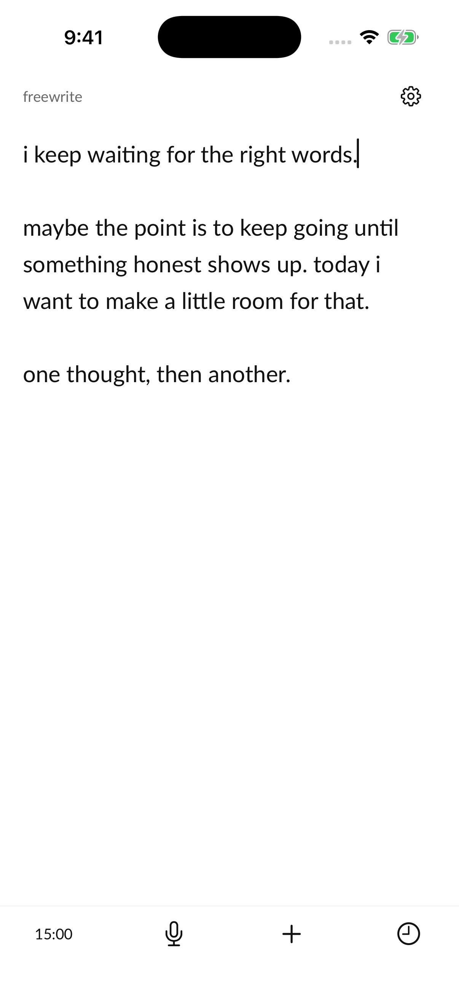
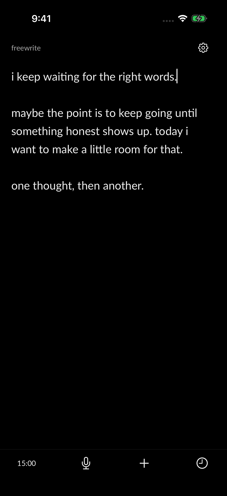
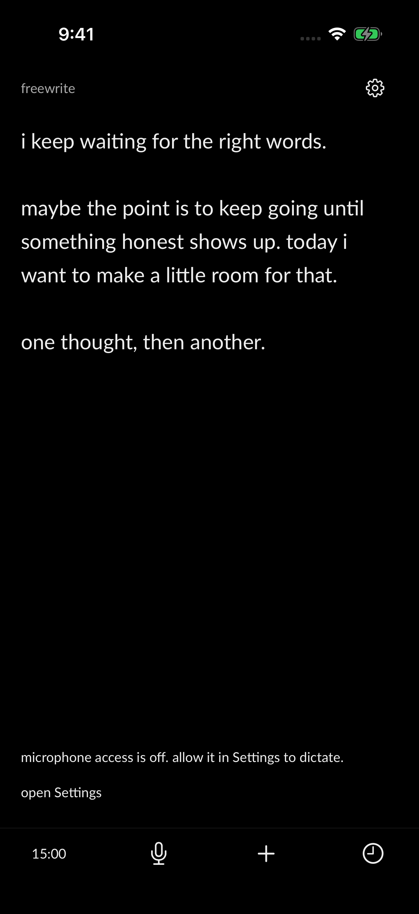

# Verification

Verified September 23, 2026 with Xcode 26.6 (17F113), Swift 6.3.3, and the iOS 26.5 iPhone 17 Pro simulator. No physical iPhone or live OpenAI credential was used.

## Automated checks

- `swift test`: 23 tests passed.
- `FREEWRITE_DERIVED_DATA=/private/tmp/freewrite-ios-20260923 scripts/test-ios.sh`: 28 simulator tests passed; Debug simulator and unsigned Release device builds succeeded without warnings.
- Regenerating `Freewrite.xcodeproj` is deterministic. Swift 6 strict concurrency and warnings-as-errors are enabled.
- Cleaner checks cover fillers, meaningful “like,” retained words, paragraphs, Unicode, and punctuation. Mocked Responses API checks cover text-only requests, `store: false`, incomplete responses, service errors, and rejected rewrites. No external cleanup request was sent.
- Entry checks cover the web JSON shape, Unix millisecond dates, null/missing deletion dates, SwiftData reopen, and tombstones. Keychain checks use a separate temporary service and remove their test values.
- Writer checks cover finalized-text checkpoints before Stop, saving provisional words while still recording, cleanup failure, interruption, insertion at a Unicode cursor, surrounding edits, overlapping edits, late cleanup, save failure/retry, and backspace lock.
- UIKit checks exercise the native undo manager restoring raw dictation and verify typing publishes only after UIKit commits the edit. This prevents SwiftUI redraws from disturbing in-flight insertion.

## Simulator walkthrough

Used a separate fresh simulator named “iPhone freewrite verification.” Typed synthetic text into the actual app, opened history, resumed the entry, started/paused the timer, and enabled backspace lock. A delete key left locked text intact. Force-terminated and relaunched the app after a checkpoint; the text returned unchanged.

Inspected the white and black system appearances, Settings, the writing toolbar, and the largest accessibility text size. The editor scrolls and the microphone error and Settings action remain readable at that size. Permission denial was produced using the simulator's real microphone permission state, then tapping Dictate in the app; no mock error screen or screenshot compositing was used.

| Write, light | Write, dark | Microphone denied |
| --- | --- | --- |
|  |  |  |

The simulator checks verify the editor, persistence, and error presentation. They do **not** establish speech recognition accuracy, actual model installation, live audio routing, or real-device interruption behavior.

## Physical iPhone checklist

- [ ] Set the final bundle ID and signing team, install on a supported iPhone running iOS 26 or newer, and verify SpeechTranscriber hardware/language availability.
- [ ] On first use, allow the microphone and watch model download progress. Cancel during installation; retry, including after a failed/offline download.
- [ ] After model installation, dictate in airplane mode. Verify live interim corrections, finalized phrases without duplicates, pauses, long continuous speech, and the last words arriving after Stop.
- [ ] Compare built-in mic and Bluetooth input in quiet/noisy surroundings. Confirm the audio engine stops when the user taps Stop.
- [ ] Place the caret before/inside/after existing text, including emoji and multiple paragraphs. Dictate, edit surrounding text, stop, and undo cleanup once. Existing text must remain intact.
- [ ] Exercise call, Siri, route removal/change, and audio-service reset where possible. Available text must remain saved; recording must require an explicit new tap.
- [ ] Background and lock the phone while dictating. Recording must stop; returning must show the interruption and retain available text. Background recording is intentionally absent.
- [ ] Force-terminate mid-dictation and relaunch. Expect the last successful text checkpoint, potentially losing the latest unsaved or unrecognized words. There is intentionally no recoverable audio file.
- [ ] Deny/revoke microphone access, reopen Settings, and retry after granting it. Check unsupported language/device messages and that typing remains available.
- [ ] With the owner's test API key, explicitly enable optional cleanup, verify only the current passage leaves the device, and test offline/invalid-key/timeouts. Raw text must survive failure; removing the key must stop future requests.
- [ ] Check VoiceOver, software keyboard, hardware-keyboard undo, dictation with the keyboard visible, landscape, and Dynamic Type on a smaller physical iPhone.

## Future reader behavior

The reader is outside this write-and-dictate slice. When it reaches iOS, imported content must support direct text editing and trimming within paragraphs, with undo, cancel, and restoration of the original import, matching the separate web reader edit PR. Writing-only slash commands are excluded.
